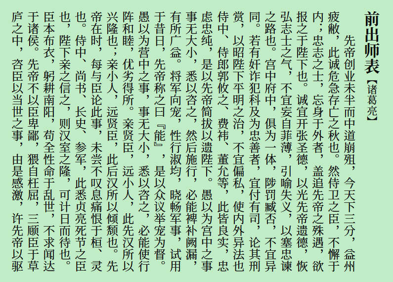
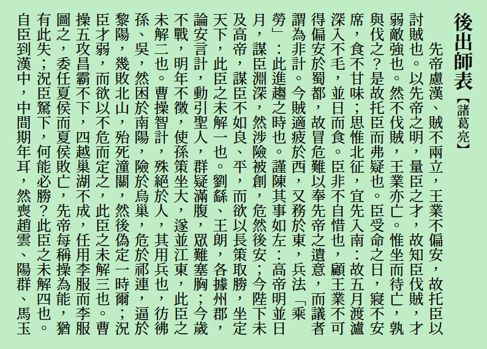

[繁體中文](../../) **简体中文**

# Early Summer Mincho 初夏明朝体
一款接近传统印刷体的中文字体，基于[思源宋体](https://github.com/adobe-fonts/source-han-serif)。

## 预览
 
 
> Note: 本字体可通过 locl 特性改变不同的标点符号。

## 字重与格式
包含可变字体，以及 7 种粗细的静态字体，使用 TrueType 格式。  
  

## 下载字体
可从本站 [Releases](../../releases) 页面下载字体。

## 授权
遵循 [SIL Open Font License 1.1](./LICENSE.txt)。

## 鸣谢
- [思源宋体](https://github.com/adobe-fonts/source-han-serif)
- [FontTools](https://github.com/fonttools/fonttools)
- [AFDKO](https://github.com/adobe-type-tools/afdko/)
- [FontForge](https://github.com/fontforge/fontforge)
