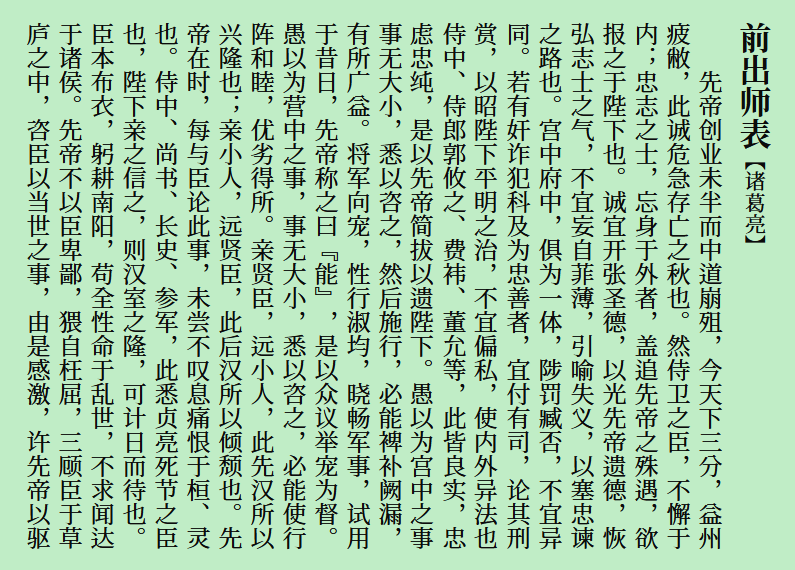

**繁體中文** [简体中文](README-SC.md)

# Early Summer Serif 初夏明朝體
一款接近傳統印刷體的中文字型，基於[思源宋體](https://github.com/adobe-fonts/source-han-serif)。

## 預覽
 
 
> NOTE: 本字型可通過 locl 特性改變不同的標點符號。

## 字重與格式
包含可變字體，以及 7 種粗細的靜態字體，使用 TrueType 和 OpenType 格式。本專案還提供了適合螢幕顯示的「屏閱初夏明朝體」。  
  

## 下載字型
可从本站 [Releases](https://github.com/GuiWonder/EarlySummerSerif/releases) 頁面下載字型。

## 授權
遵循 [SIL Open Font License 1.1](./LICENSE.txt)。

## 鳴謝
- [思源宋體](https://github.com/adobe-fonts/source-han-serif)
- [FontTools](https://github.com/fonttools/fonttools)
- [AFDKO](https://github.com/adobe-type-tools/afdko/)
- [FontForge](https://github.com/fontforge/fontforge)
